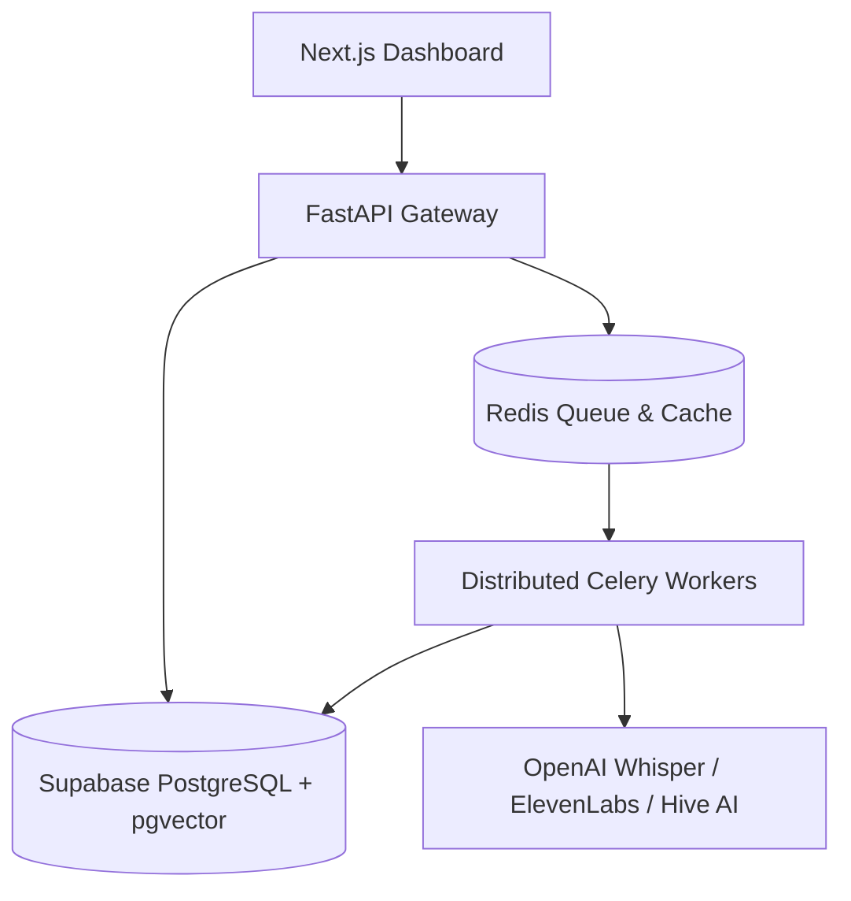

# Architecture: CreatorShield Compliance Intelligence Engine

CreatorShield is a multi-tenant audit system that automatically detects content farm operations, script recycling, and synthetic media fraud across vast creator portfolios.

## System Topology

## Core Modules

### 1. Semantic Content Fingerprinting
- Generates 384-dimensional dense sentence embeddings using local `sentence-transformers` models or OpenAI's embeddings API.
- Stores vectors in PostgreSQL using `pgvector` extension for semantic search and clustering.
- Detects paraphrasing, topic recycling, and template rigidity.

### 2. Policy Correlation Rules Engine
- Maps low-level forensic indicators (SSIM, ZCR variance, transcript overlap) to high-level policy risks.
- Emits structured warnings covering Reused Content, Inauthentic Behavior, and Guideline Violations.

### 3. Cross-Channel Network Reputation Model
- Calculates a weighted, composite Trust Index (0-100) per channel.
- Aggregates trust scores into a portfolio threat score and monetization stability index.

### 4. Distributed Media Pipeline
- Standard Celery tasks run on isolated queues (`default`, `audit`, `heavy`).
- Processes heavy audio/visual files asynchronously with rate-limiting, deduplication, and failure recovery.
